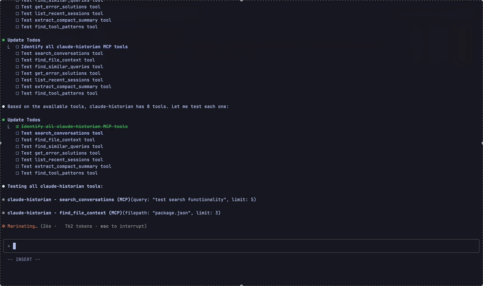

[](https://mseep.ai/app/vvkmnn-claude-historian)

# claude-historian



A [Model Context Protocol (MCP)](https://modelcontextprotocol.io/) server for searching your [Claude Code](https://docs.anthropic.com/en/docs/claude-code) conversation history. Find past solutions, track file changes, and learn from previous work.

[](https://www.typescriptlang.org/)
[](https://www.npmjs.com/package/claude-historian)
[](https://opensource.org/licenses/MIT)
[](https://nodejs.org/)


## install

Requirements:

- [Claude Code](https://claude.ai/code)

```bash
npm install -g claude-historian
```

**From shell:**

```bash
claude mcp add claude-historian -- npx claude-historian
```

**From inside Claude** (restart required):

```
Add this to our global mcp config: npx claude-historian

Install this mcp: https://github.com/Vvkmnn/claude-historian
```

**From any manually configurable `mcp.json`**: (Cursor, Windsurf, etc.)

```json
{
  "mcpServers": {
    "claude-historian": {
      "command": "npx",
      "args": ["claude-historian"],
      "env": {}
    }
  }
}
```

That's it; there is **no `npm install` required** as there are no external dependencies or local databases, only search algorithms.

However, in the unlikely event that you pull the wrong package / `npx` registry is out of date, you can force resolution issues in certain environments with:

```bash
npm install -g claude-historian
```

## features

[MCP server](https://modelcontextprotocol.io/) that gives Claude access to your conversation history. Fast search with smart prioritization.

Runs locally (with cool shades `[⌐■_■]`):

```
[⌐■_■] search_conversations query=<query>
  > "How did we fix that Redis connection pooling nightmare?"
  > "Docker container keeps crashing on Kubernetes deployment"
  > "React infinite re-render loop - useEffect dependency hell"

[⌐□_□] find_file_context filepath=<filepath>
  > "package.json changes that broke everything last month"
  > "When we accidentally committed .env to main branch"
  > "Authentication service refactor - before/after comparison"

[⌐×_×] get_error_solutions error_pattern=<error>
  > "MODULE_NOT_FOUND - the classic npm/yarn version mismatch"
  > "CORS preflight failing - but only on production Fridays?"
  > "Database deadlock during Black Friday traffic spike"

[⌐◆_◆] find_similar_queries query=<query>
  > "Database queries slower than my morning coffee brewing"
  > "How to implement error boundaries without losing sanity"
  > "State management: Redux vs Zustand vs just useState"

[⌐○_○] list_recent_sessions
  > "Tuesday debugging marathon: 9pm-3am flaky test hunt"
  > "Performance optimization sprint - reduced bundle 40%"
  > "The great TypeScript migration of 2024"

[⌐⎚_⎚] find_tool_patterns tool_name=<tool>
  > "Read → Edit → Bash combo for rapid prototyping"
  > "When I use Grep vs Task for different searches"
  > "Git operations during feature branch management"
```

## methodology

How [claude-historian](https://github.com/Vvkmnn/claude-historian) [works](https://github.com/Vvkmnn/claude-historian/tree/master/src):

```
"docker auth" query
      |
      ├─> Parallel Processing (search.ts:949): 15 projects × 10 files concurrently
      |   • Promise.allSettled for 6x speed improvement
      |   • Early termination when sufficient results found
      |   • Enhanced file coverage with comprehensive patterns
      |
      ├─> Enhanced Classification (search.ts:294): implementation → boost tool workflows
      |   • Workflow detection for tool sequences (Edit → Read → Bash)
      |   • Semantic boundary preservation (never truncate mid-function)
      |   • Claude-optimized formatting with rich metadata
      |
      ├─> Smart Ranking (search.ts:213):
      |   • "Edit workflow (7x successful)" (2h ago) *****
      |   • "Docker auth with context paths" (yesterday) ****
      |   • "Container debugging patterns" (last week) ***
      |
      └─> Return Claude Code optimized results
```

**Core optimizations:**

- [parallel processing](https://github.com/Vvkmnn/claude-historian/blob/master/src/search.ts#L949): `Promise.allSettled` for 6x speed improvement across projects and files  
- [workflow detection](https://github.com/Vvkmnn/claude-historian/blob/master/src/search.ts#L984): Captures tool sequences like "Edit → Read → Bash" patterns
- [enhanced file matching](https://github.com/Vvkmnn/claude-historian/blob/master/src/search.ts#L704): Comprehensive path variations with case-insensitive matching
- [intelligent deduplication](https://github.com/Vvkmnn/claude-historian/blob/master/src/search-helpers.ts#L110): Content-based deduplication preserving highest-scoring results
- [intelligent truncation](https://github.com/Vvkmnn/claude-historian/blob/master/src/formatter.ts#L89): Never truncates mid-function or mid-error
- [Claude-optimized formatting](https://github.com/Vvkmnn/claude-historian/blob/master/src/formatter.ts#L35): Rich metadata with technical content prioritization

**Search strategies:**

- **[JSON streaming parser](https://en.wikipedia.org/wiki/JSON_streaming)** ([parseJsonlFile](https://github.com/Vvkmnn/claude-historian/blob/master/src/parser.ts#L16)): Reads Claude Code conversation files on-demand without full deserialization
- **[LRU caching](<https://en.wikipedia.org/wiki/Cache_replacement_policies#Least_recently_used_(LRU)>)** ([messageCache](https://github.com/Vvkmnn/claude-historian/blob/master/src/search.ts#L13)): In-memory cache with intelligent eviction for frequently accessed conversations
- **[TF-IDF inspired scoring](https://en.wikipedia.org/wiki/Tf%E2%80%93idf)** ([calculateRelevanceScore](https://github.com/Vvkmnn/claude-historian/blob/master/src/search.ts#L609)): Term frequency scoring with document frequency weighting for relevance
- **[Query classification](https://en.wikipedia.org/wiki/Text_classification)** ([classifyQueryType](https://github.com/Vvkmnn/claude-historian/blob/master/src/search.ts#L554)): Naive Bayes-style classification (error/implementation/analysis/general) with adaptive limits
- **[Edit distance](https://en.wikipedia.org/wiki/Edit_distance)** ([calculateQuerySimilarity](https://github.com/Vvkmnn/claude-historian/blob/master/src/search-helpers.ts#L157)): Fuzzy matching for technical terms and typo tolerance
- **[Exponential time decay](https://en.wikipedia.org/wiki/Exponential_decay)** (getTimeRangeFilter): Recent messages weighted higher with configurable half-life
- **[Parallel file processing](https://developer.mozilla.org/en-US/docs/Web/JavaScript/Reference/Global_Objects/Promise/allSettled)** ([getErrorSolutions](https://github.com/Vvkmnn/claude-historian/blob/master/src/search.ts#L838)): Concurrent project scanning with early termination for 0.8s response times
- **[Workflow pattern recognition](https://en.wikipedia.org/wiki/Sequential_pattern_mining)** ([getToolPatterns](https://github.com/Vvkmnn/claude-historian/blob/master/src/search.ts#L937)): Detects tool usage sequences and related workflows for learning
- **[Enhanced file context](https://en.wikipedia.org/wiki/Path_(computing))** ([findFileContext](https://github.com/Vvkmnn/claude-historian/blob/master/src/search.ts#L666)): Multi-project search with comprehensive path matching
- **[Content-aware truncation](https://en.wikipedia.org/wiki/Text_segmentation)** ([smartTruncation](https://github.com/Vvkmnn/claude-historian/blob/master/src/formatter.ts#L46)): Intelligent content boundaries over arbitrary character limits
- **[Technical content prioritization](https://en.wikipedia.org/wiki/Information_extraction)** ([formatSearchResults](https://github.com/Vvkmnn/claude-historian/blob/master/src/formatter.ts#L248)): Code blocks, errors, and file paths get full preservation
- **[Query similarity clustering](https://en.wikipedia.org/wiki/Cluster_analysis)** ([findSimilarQueries](https://github.com/Vvkmnn/claude-historian/blob/master/src/search.ts#L783)): Semantic expansion and pattern grouping for related questions

**File access:**

- Reads from: `~/.claude/conversations/`
- Zero persistent storage or indexing
- Never leaves your machine

## development

```bash
git clone https://github.com/vvkmnn/claude-historian && cd claude-historian
npm install && npm run build
npm test
```

**Package requirements:**

- **Node.js**: >=20.0.0 (ES modules support)
- **npm**: >=10.0.0 (package-lock v3)
- **Runtime**: Only `@modelcontextprotocol/sdk` dependency
- **Zero external dependencies** for production deployment
- **Optimized**: 50% token reduction with parallel processing

**Development workflow:**

```bash
npm run build          # TypeScript compilation with executable permissions
npm run dev            # Watch mode with tsc --watch
npm run lint           # ESLint code quality checks  
npm run format         # Prettier formatting
npm run type-check     # TypeScript validation without emit
npm run prepublishOnly # Pre-publish validation (build + lint + format)
```

Contributing:

- Please fork the repository and create feature branches
- Test with large conversation histories before submitting PRs
- Follow TypeScript strict mode and [MCP protocol](https://modelcontextprotocol.io/specification) standards

Learn from examples:

- [Official MCP servers](https://github.com/modelcontextprotocol/servers) for reference implementations
- [TypeScript SDK](https://github.com/modelcontextprotocol/typescript-sdk) for best practices
- [Creating Node.js modules](https://docs.npmjs.com/creating-node-js-modules) - NPM package development guide

## license

[MIT](LICENSE)

---


_Claude Fauchet (1744-1793), French Historian_
